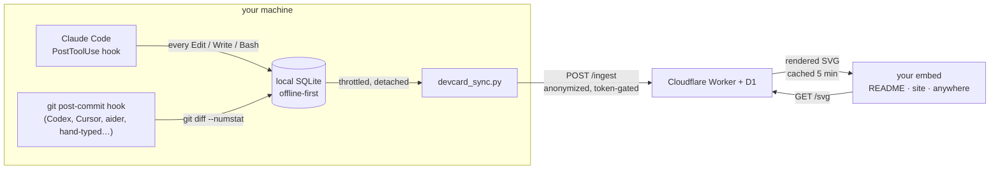

<h1 align="center">devcard</h1>

<p align="center">
  <strong>A live, embeddable dev stats card — powered by your real AI-assisted coding activity, not your keystrokes.</strong>
</p>

<p align="center">
  <a href="https://github.com/augbastos/devcard/actions/workflows/ci.yml"></a>
  <a href="LICENSE"></a>
  
  
  
</p>

<!-- devcard:start -->
<p></p>
<!-- devcard:end -->

<p align="center"><em>↑ A real, live card. Point at the bar and it names the language under the pointer.</em></p>

WakaTime and friends are built around time spent coding. devcard is built around
a different question: **what came out of the session**. A hook records the edits
your agent makes — or, for any other tool, each commit — and your card updates
from there.

- **Live, not batch.** An edit reaches your Worker within about half a minute,
  and the rendered card is cached for five minutes — not "synced last night".
- **Content-private by architecture.** Code, file names, paths and project names
  never leave your machine; nothing the hooks send has a field that could hold
  one. What does leave is activity metadata — when, which language, how many
  lines and bytes — plus a repository count and a random installation id.
  [Exactly what, and what the card shows →](docs/privacy-and-security.md)
- **Embeds anywhere** an `` works, follows the viewer's light/dark theme,
  and speaks en/pt/es.

## Get one

Python 3.11+, Node 22+, npm, git, and a free
[Cloudflare account](https://dash.cloudflare.com/sign-up). The installer checks
all of them before it creates anything in your Cloudflare account.

```bash
git clone https://github.com/augbastos/devcard && cd devcard && python install.py
```

It creates your D1 database, deploys your Worker, installs the capture hook, and
prints your embed. Your deployment's settings go to a gitignored config, never
into a tracked file, and re-running it is safe
([a second machine](docs/manual-setup.md#adding-a-second-machine) copies the
token and URL instead). Two questions — three in `git`
mode, which also asks where your repos live.
[By hand instead →](docs/manual-setup.md)

## Works with your agent

Pick **one** capture mode per machine; running both would count the same lines
twice.

| | Mode | Granularity |
|---|---|---|
| **Claude Code** | `claude` | Live, per-edit — the card moves while you code |
| **Anything that commits through git** | `git` | Per-commit, real diff stats |

`git` mode hooks git itself rather than the agent, so anything that commits
through git is covered — Codex, Cursor, aider, Windsurf, a local model, your own
hands — with no per-tool integration to maintain:

```bash
python hook/install_git_hook.py "C:/path/to/your projects"   # a repo, or a folder of repos
```

## Embed it

```html
/svg?user=<you>" alt="devcard" />
```

For your GitHub profile: create a repo named exactly like your username and
paste that line into its README.

| `?layout=` | Size | |
|---|---|---|
| `full` *(default)* | 480×tall | Avatar, streak, language bar, 16-week heatmap, pinned repos, stats, badges |
| `wide` | 840×~430 | The same across a README's full column |
| `banner` | 480×72 | One-line strip for forum sigs |
| `half` | 480×152 | Header, lines, language bar, stats |
| `vertical` | 280×264 | Narrow column for sidebars |

`?theme=` takes `default` (follows the viewer's system theme), `dark`, `light`,
`gentle`, `cyberpunk` or `terminal`. `?langs=all` names every language in the
legend instead of grouping the tail.

## Hover, inside a GitHub README

The bar draws every language to exact proportion, so a real account ends in a
tail thinner than a pixel. Point at a segment and it names that language and its
share — slivers included.

A README renders the card through an ``, where no pointer event reaches the
SVG, so the card is served in pieces instead: one image per language, each
carrying its own tooltip.
[How, and what GitHub's sanitizer allows →](docs/hover-in-a-readme.md)

## How it works



Events land locally first, so capture works offline and never blocks your
session. Each event carries a random installation id and its local row id, so a
retried batch, a second machine or a deleted local database never counts
anything twice — or mistakes new work for a duplicate. Rollup tables mean one render reads about a hundred rows rather
than one per event ever recorded, which is what keeps a card inside the free
tier.

## Built to be checked

- **Tests run against the real thing.** The Worker suite runs inside workerd
  against a local D1; the git suite builds throwaway repositories and runs real
  git — merges, worktrees, `core.hooksPath`, husky, paths with spaces.
- **CI with no Cloudflare account or secret**: the Python suites on Linux and
  Windows at 3.11 and 3.14, the Worker on Node 22 and 24 — a fork's pull request
  runs all of it.
- **Supply chain**: a locked npm tree installed without install scripts, every
  Action pinned to a commit SHA, Dependabot, dependency review, Gitleaks over the
  full history, and CodeQL for TypeScript, Python and the workflows themselves.

## Going deeper

| | |
|---|---|
| [Hover in a README](docs/hover-in-a-readme.md) | GitHub's sanitizer, measured, and the split card |
| [What the numbers mean](docs/counting.md) | Counting rules, merge commits, two machines |
| [Privacy and security](docs/privacy-and-security.md) | What leaves your machine, and what stops it |
| [Known limitations](docs/limitations.md) | Where it under- and over-counts, and why |
| [Making it yours](docs/customizing.md) | Themes, layouts, badges, pinned repos |
| [Development and CI](docs/development.md) | Both suites, the checks, and one deploy trap |
| [Manual setup](docs/manual-setup.md) | The wizard's steps, by hand |
| [Event retention](docs/retention.md) | Why nothing is deleted, and how to measure your own |

---

Built by [Augusto Bastos](https://github.com/augbastos) · MIT
