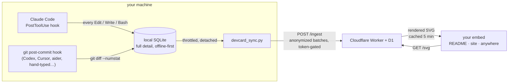

<h1 align="center">devcard</h1>

<p align="center">
  <strong>A live, embeddable dev stats card — powered by your real AI-assisted coding activity, not your keystrokes.</strong>
</p>

<p align="center">
  <a href="https://github.com/augbastos/devcard/actions/workflows/ci.yml"></a>
  <a href="LICENSE"></a>
  
  
  
</p>

<!-- devcard:start -->
<p></p>
<!-- devcard:end -->

<p align="center"><em>↑ A real, live card. Point at the bar and it names the language under the pointer.</em></p>

WakaTime and friends are built around time spent coding. devcard is built
around a different question: **what came out of the session**. A tiny hook
records the edits your agent makes — or, for any other tool, each commit — and
your card updates from there: languages, volume, commits, activity, wherever
it's embedded.

## Why it's different

- **Live, not batch.** Edits reach the backend within seconds of being made, and
  the card is cached for five minutes — so a viewer sees your session at worst
  five minutes old, not "synced last night."
- **Measures agent output.** It counts what your agent actually wrote — the
  edits, not the clock.
- **Private by architecture, not by promise.** Project names, file paths and
  code content **never leave your machine** — there is no column in the public
  database where a filename could even be stored.
  [How that is enforced →](docs/privacy-and-security.md)
- **Embeds anywhere.** It's just an SVG URL. README, portfolio, blog, anywhere
  `` works — and inside a GitHub README the language bar is
  [hoverable](#hover-that-survives-a-github-readme).
- **Follows the viewer.** Auto light/dark via `prefers-color-scheme`, and
  auto-localized to en/pt/es.

## Get one

You need Python 3.9+, Node 18+, npm, git, and a free
[Cloudflare account](https://dash.cloudflare.com/sign-up). The wizard checks all
of them before it creates anything.

```bash
git clone https://github.com/augbastos/devcard && cd devcard && python setup.py
```

It creates your D1 database, applies the schema, generates and stores your
ingest token, deploys your Worker, installs the capture hook, checks your token
against the deployed Worker, and prints your ready-to-paste embed. Two questions
in `claude` mode, three in `git` mode — it also asks where your repos live.

Prefer to do it by hand? [Manual setup →](docs/manual-setup.md)

## How it works



Events land in local SQLite first, so capture works offline and never blocks
your session. Anonymized batches sync to a Cloudflare Worker + D1. Rollup
tables mean one render reads about a hundred rows rather than one per event
ever recorded, which is what keeps a card inside the free tier.

## Works with your agent

Pick **one** capture mode per machine; running both would count the same lines
twice.

| | Mode | Granularity |
|---|---|---|
| **Claude Code** | `claude` | Live, per-edit — the card moves while you code |
| **Anything that commits through git** | `git` | Per-commit, real diff stats |

…which in practice means Codex, Cursor, aider, Windsurf, Cline, a local model
through Ollama or LM Studio, or your own hands.

`git` mode hooks **git itself, not the agent**, so there is no per-tool
integration to maintain and a new agent needs no work at all. The one gap is a
client that writes commits without invoking git — some GUIs built on libgit2 —
which never fires the hook.

```bash
python hook/install_git_hook.py "C:/path/to/your projects"   # a repo, or a folder of repos
```

It handles `core.hooksPath`, worktrees, submodules and husky, appends to an
existing hook rather than overwriting it, and refuses to touch a `post-commit`
that isn't a shell script. [Details →](docs/manual-setup.md#installing-the-git-hook)

## Embed it

```html
/svg?user=<you>" alt="devcard" />
```

For your GitHub profile: create a repo named exactly like your username and
paste that line into its README.

**Layouts** (`?layout=`):

| Value | Size | What you get |
|---|---|---|
| `full` *(default)* | 480×tall | Everything: avatar, streak, language bar + legend, 16-week heatmap, pinned repos, stats, badges |
| `wide` | 840×~430 | The same, laid across a README's full column — legend in columns, bigger heatmap, pinned repos beside it |
| `banner` | 480×72 | One-line strip for forum sigs and tight READMEs |
| `half` | 480×152 | Header, lines, language bar, stats row |
| `vertical` | 280×264 | Narrow column for site and blog sidebars |

**Themes** (`?theme=`): `default` (follows the viewer's system theme) · `dark` ·
`light` · `gentle` · `cyberpunk` · `terminal`.

Add `?langs=all` to name every language in the legend instead of collapsing the
tail into one `other` row.

The heatmap paints real per-day output (intensity relative to your own p90, so
one huge day doesn't flatten the rest), the flame lights at a 7+ day streak, and
the footer shows "updated Xmin ago" — a live card that can prove it's live.

## Hover that survives a GitHub README

The bar draws every language to exact proportion, which on a real account means
a tail thinner than a pixel. Pointing at a segment names it and shows its share
— including the slivers.

That works out of the box wherever the SVG is a *document*. A GitHub README is
not one: it renders the card through an ``, where no pointer event reaches
the SVG, and GitHub's sanitizer strips every element that could carry the
interaction instead. So the card is served in pieces — one image per language,
each with its own tooltip — and the bar is the card's last row.

[The measurements behind that, and how to use it →](docs/hover-in-a-readme.md)

## Make it yours

MIT licensed. No framework and no build step for the card itself — just plain
SVG template strings.

| Want to change | Look in |
|---|---|
| Colours and themes | `worker/src/themes.ts` — a theme is a handful of hex values |
| Layout | `worker/src/render.ts`, `render-wide.ts`, `render-layouts.ts` |
| Language detection | `EXT_LANGUAGE` in `hook/devcard_lib.py` |
| Language colours | `LANGUAGE_COLORS` in `worker/src/svg-utils.ts` |
| Strings and locales | `STRINGS` in `worker/src/variants.ts` — a locale is ~1 line |

**Badges and pinned repos** are rows you insert yourself:

```bash
cd worker
npx wrangler d1 execute devcard --remote --command \
  "INSERT INTO profile_entries (kind, label, detail, created_at) VALUES ('certification', 'AWS Cloud Practitioner', NULL, strftime('%s','now'))"
npx wrangler d1 execute devcard --remote --command \
  "INSERT INTO pinned_repos (repo, note, position, created_at) VALUES ('wavr', 'privacy-first home presence', 1, strftime('%s','now'))"
```

`kind` is `badge` | `certification` | `award`. Up to 3 pinned repos render as
linked boxes with a live star count; lowest `position` first.

## Tests

```bash
python -m unittest discover -s hook -p "test_*.py"    # hook + git integration
cd worker && npm ci && npm run typecheck && npm test  # Worker, workerd + local D1
```

The Worker suite runs inside workerd against a real local D1, so ingest, the
unique index, the cache key and the rollup rebuild are exercised by the engine
production uses — no Cloudflare account, secret or network access involved. The
Python suite builds throwaway git repositories and runs real `git` against them,
because the merge and hook-installation behaviour it pins is behaviour of git,
which a mock would only have agreed with.
[`ci.yml`](.github/workflows/ci.yml) runs both on every pull request, with the
hook suite on Python 3.9, 3.11 and 3.13.

## Known limitations

- **Squash merges can double-count** in `git` mode if the squashed branch's own
  commits were captured on the same machine.
- **`git commit --amend` double-counts** in `git` mode: `post-commit` runs
  again and the amended commit's whole diff is read a second time. `claude`
  mode does filter it.
- **The two capture modes are exclusive per machine.**
  `~/.claude/devcard/mode` is what keeps the git hook quiet on a Claude Code
  machine.
- **`worker/wrangler.toml` is edited by `setup.py`.** It's your fork's
  deployment config and belongs committed there, but `git status` isn't clean
  after setup.
- **Raw events are never deleted** — deliberate, and measured.
- **Links inside the card don't click** when embedded via `` — a browser
  limitation of anything loaded that way. Wrapping the image in a link makes
  the whole card clickable, if that is enough.

## Going deeper

| | |
|---|---|
| [What the numbers mean](docs/counting.md) | Counting rules, merge commits, event identity across machines |
| [Privacy and security](docs/privacy-and-security.md) | What leaves your machine, and what stops it |
| [Hover in a README](docs/hover-in-a-readme.md) | GitHub's sanitizer, measured, and the split card |
| [Event retention](docs/retention.md) | Why nothing is deleted, with the numbers |
| [Manual setup](docs/manual-setup.md) | The wizard's steps, by hand |

## Roadmap

Signed batches for tamper-evident sync · more locales and community themes
(a theme is ~20 lines of tokens — PRs welcome) · multi-user hosted mode.

---

Built by [Augusto Bastos](https://github.com/augbastos) · MIT
